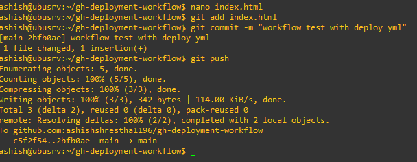

# GitHub Actions Deployment Workflow

## Project Overview
This project demonstrates **Continuous Integration (CI)** and **Continuous Deployment (CD)** by automatically deploying a static website to **GitHub Pages** whenever the `index.html` file changes.  
It helps understand how GitHub Actions can automate repetitive tasks like deploying updates without manual intervention.

---

## 🌐 Live Demo
Here is an example of the deployed website:


## ⚙️ Project Execution

### 1. Repository Setup
- Repository name: `gh-deployment-workflow`
- Files included:
  - `index.html` → Simple static website
  - `README.md` → This documentation
  - `.github/workflows/deploy.yml` → GitHub Actions workflow

### 2. GitHub Pages Configuration
- Enable GitHub Pages in the repository:
  - Go to **Settings → Pages → Build and deployment**
  - Source: **Deploy from GitHub Actions**
  - Branch: `main`
- This provides a public URL for your website:

### 3. GitHub Actions Workflow
- Workflow triggers **only on changes to `index.html`** in the `main` branch.
- Steps performed:
1. Checkout the repository
2. Configure GitHub Pages
3. Upload the website artifact
4. Deploy the artifact to GitHub Pages


### 4. Updating the Website
- Make any changes to `index.html`.
- Commit and push the changes to the `main` branch:
```bash
git add index.html
git commit -m "Update website content"
git push origin main
```


---

## Learning Outcomes

* How to create and configure GitHub Actions workflows
* How to deploy a static site automatically using GitHub Pages
* How CI/CD works in practice
* Workflow triggers and conditional deployments (deploy only when certain files change)
* Managing GitHub repository settings for automated deployment
